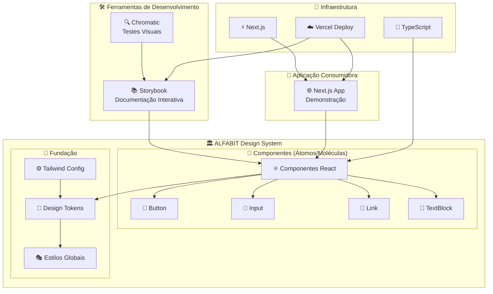

# ALFABIT-DESIGN-SYSTEM: Um Framework de Componentes para Interfaces Modulares

_Orquestrando Consistência e Escalabilidade Visual com Precisão Atômica._

<div align="center">

<!-- Badges de CI/CD e Qualidade -->


**[🚀 Ver Demonstração Ao Vivo](https://design-system-gamma-lovat.vercel.app)**

</div>


---

## 🎯 Visão Geral

No contexto do desenvolvimento web contemporâneo, a demanda por interfaces de usuário (UI) que sejam simultaneamente consistentes, escaláveis e de fácil manutenção representa um desafio de engenharia significativo. O **ALFABIT-DESIGN-SYSTEM** aborda este problema fundamental ao propor um sistema de design coeso e uma biblioteca de componentes reutilizáveis, concebida para ser a fonte canônica da verdade visual e interativa de um ecossistema de produtos digitais.

Este projeto materializa-se como uma biblioteca de componentes React, desenvolvida com base em um stack tecnológico moderno que inclui **Next.js**, **TypeScript** e **TailwindCSS**. A metodologia central adota princípios de design atômico, onde componentes fundamentais são projetados para serem composicionais, flexíveis e robustos.

## 🏆 Status do Projeto

<div align="center">


</div>

## 📖 Sumário

1. [🚀 Demonstração e Recursos](#-demonstração-e-recursos)
2. [✨ Principais Funcionalidades](#-principais-funcionalidades)
3. [🏗️ Arquitetura do Sistema](#️-arquitetura-do-sistema)
4. [🛠️ Stack Tecnológico](#️-stack-tecnológico)
5. [📁 Estrutura do Projeto](#-estrutura-do-projeto)
6. [⚡ Instalação Rápida](#-instalação-rápida)
7. [💻 Uso e Exemplos](#-uso-e-exemplos)
8. [📚 Componentes Disponíveis](#-componentes-disponíveis)
9. [🎨 Customização e Temas](#-customização-e-temas)
10. [🧪 Testes e Qualidade](#-testes-e-qualidade)
11. [🚀 Deploy](#-deploy)
12. [🤝 Contribuindo](#-contribuindo)
13. [📄 Licença](#-licença)
14. [👨‍💻 Autor](#-autor)

## 🚀 Demonstração e Recursos

### 🎯 Acesso Direto

**[➡️ Explore o Design System Completo (Storybook)](https://design-system-gamma-lovat.vercel.app)**

### 🌟 Destaques da Demonstração

- **Interface Interativa**: Todos os componentes podem ser testados em tempo real
- **Documentação Viva**: Cada componente possui documentação detalhada e exemplos práticos
- **Playground de Customização**: Altere propriedades e veja os resultados instantaneamente
- **Casos de Uso Reais**: Exemplos práticos de implementação em aplicações

## ✨ Principais Funcionalidades

### 🎨 **Sistema de Design Coeso**

- Tokens de design centralizados para cores, tipografia e espaçamentos
- Consistência visual garantida em todos os componentes
- Tematização flexível com suporte a múltiplos temas

### 🧱 **Componentes Atômicos**

- **Button**: 5 variantes visuais, 4 tamanhos, estados de loading/disabled
- **Input**: Campos versáteis com validação, ícones e modo multilinha
- **Link**: Navegação inteligente com detecção automática de links externos
- **TextBlock**: Blocos de conteúdo flexíveis para cards e destacues

### 🔧 **Experiência do Desenvolvedor**

- **TypeScript First**: Tipagem completa e autocompletar inteligente
- **Storybook Integrado**: Desenvolvimento e teste de componentes em isolamento
- **Zero Configuração**: Funciona imediatamente após a instalação
- **Performance Otimizada**: CSS utilitário com Tailwind para builds enxutos

### 🧪 **Qualidade Assegurada**

- Testes visuais automatizados com Chromatic
- Linting com ESLint para código consistente
- Documentação interativa sempre atualizada

## 🏗️ Arquitetura do Sistema



## 🛠️ Stack Tecnológico

<div align="center">

|                                                Tecnologia                                                |  Versão  |           Propósito            |
| :------------------------------------------------------------------------------------------------------: | :------: | :----------------------------: |
|            | `14.2.3` |  Framework React com SSR/SSG   |
|                    |  `^18`   |   Biblioteca para interfaces   |
|      |   `^5`   |        Tipagem estática        |
|  | `^3.4.1` |    Framework CSS utilitário    |
|      | `^8.1.2` | Desenvolvimento de componentes |
|              |  Latest  |      Plataforma de deploy      |

</div>

## 📁 Estrutura do Projeto

```
DesignSystem/
├── 📚 .storybook/                 # Configurações do Storybook
│   ├── main.ts                   # Configuração principal
│   └── preview.ts                # Configuração de preview
├── 🧱 components/                 # Biblioteca de componentes
│   ├── Button/                   # Componente Button
│   │   ├── Button.tsx            # Implementação
│   │   ├── Button.stories.tsx    # Stories do Storybook
│   │   └── Button.mdx            # Documentação
│   ├── Input/                    # Componente Input
│   ├── Link/                     # Componente Link
│   └── TextBlock/                # Componente TextBlock
├── 🌐 pages/                      # Páginas da aplicação demo
│   ├── _app.tsx                  # App component
│   ├── _document.tsx             # Document customizado
│   └── index.tsx                 # Página inicial
├── 🎬 video/                      # Assets de demonstração
│   └── Designsytem.gif           # GIF da demonstração
├── 🎨 styles/                     # Estilos globais
│   └── globals.css               # CSS global + Tailwind
├── ⚙️ tailwind.config.js          # Configuração do Tailwind
├── 📘 tsconfig.json               # Configuração TypeScript
└── 📦 package.json                # Dependências e scripts
```

## ⚡ Instalação Rápida

### 🔧 Pré-requisitos

- **Node.js** `^18.0` ou `^20.0`
- **npm** `^9.0` (ou yarn/pnpm)
- **Git**

### 🚀 Comandos de Instalação

```bash
# 1. Clone o repositório
git clone https://github.com/ESousa97/DesignSystem.git

# 2. Entre no diretório
cd DesignSystem

# 3. Instale as dependências
npm install

# 4. Inicie o Storybook (recomendado)
npm run storybook
# Abra http://localhost:6006

# OU inicie a aplicação demo
npm run dev
# Abra http://localhost:3000
```

## 💻 Uso e Exemplos

### 🎯 Exemplo Básico: Formulário de Contato

```tsx
import Button from '@/components/Button/Button'
import Input from '@/components/Input/Input'
import { FiUser, FiMail, FiMessageSquare } from 'react-icons/fi'

export default function ContactForm() {
  return (
    <div className="mx-auto max-w-md rounded-lg bg-white p-6 shadow-lg">
      <h2 className="text-2xl mb-6 font-bold text-gray-800">Entre em Contato</h2>

      <form className="space-y-4">
        <Input
          label="Nome Completo"
          placeholder="Seu nome aqui"
          leftIcon={<FiUser />}
          variant="outlined"
        />

        <Input
          type="email"
          label="E-mail"
          placeholder="seu@email.com"
          leftIcon={<FiMail />}
          variant="outlined"
          helperText="Nunca compartilharemos seu e-mail"
        />

        <Input
          label="Mensagem"
          placeholder="Sua mensagem..."
          leftIcon={<FiMessageSquare />}
          multiline
          variant="outlined"
        />

        <Button type="submit" variant="primary" size="lg" fullWidth>
          Enviar Mensagem
        </Button>
      </form>
    </div>
  )
}
```

### 🎨 Exemplo Avançado: Dashboard Card

```tsx
import TextBlock from '@/components/TextBlock/TextBlock'
import Button from '@/components/Button/Button'
import { FiTrendingUp, FiUsers, FiDollarSign } from 'react-icons/fi'

export default function Dashboard() {
  return (
    <div className="md:grid-cols-3 grid grid-cols-1 gap-6 p-6">
      <TextBlock
        variant="elevated"
        size="md"
        icon={<FiTrendingUp />}
        title="Vendas do Mês"
        children="Aumento de 23% em relação ao mês anterior. Excelente performance da equipe!"
        actionButton={{
          text: 'Ver Detalhes',
          onClick: () => console.log('Navegando para vendas...'),
        }}
        animated
      />

      <TextBlock
        variant="gradient"
        size="md"
        icon={<FiUsers />}
        title="Novos Usuários"
        children="1.247 novos usuários se cadastraram esta semana."
        actionButton={{
          text: 'Gerenciar',
          onClick: () => console.log('Navegando para usuários...'),
        }}
      />

      <TextBlock
        variant="outlined"
        size="md"
        icon={<FiDollarSign />}
        title="Receita Total"
        children="R$ 45.780,90 de receita acumulada no trimestre."
      />
    </div>
  )
}
```

## 📚 Componentes Disponíveis

### 🔲 Button

**Componente de ação versátil com múltiplas variações**

| Propriedade |   Tipo    |                         Opções                         |  Padrão   |
| :---------: | :-------: | :----------------------------------------------------: | :-------: |
|  `variant`  |  string   | `primary`, `secondary`, `tertiary`, `ghost`, `outline` | `primary` |
|   `size`    |  string   |                 `sm`, `md`, `lg`, `xl`                 |   `md`    |
|  `loading`  |  boolean  |                    `true`, `false`                     |  `false`  |
| `disabled`  |  boolean  |                    `true`, `false`                     |  `false`  |
| `fullWidth` |  boolean  |                    `true`, `false`                     |  `false`  |
|   `icon`    | ReactNode |                     Qualquer ícone                     |     -     |

### 📝 Input

**Campo de entrada com validação e estados visuais**

|       Propriedade        |   Tipo    |             Opções              |  Padrão   |
| :----------------------: | :-------: | :-----------------------------: | :-------: |
|        `variant`         |  string   | `default`, `filled`, `outlined` | `default` |
|          `size`          |  string   |        `sm`, `md`, `lg`         |   `md`    |
|         `error`          |  string   |        Mensagem de erro         |     -     |
|        `success`         |  boolean  |         `true`, `false`         |  `false`  |
|       `multiline`        |  boolean  |         `true`, `false`         |  `false`  |
| `leftIcon` / `rightIcon` | ReactNode |         Qualquer ícone          |     -     |

### 🔗 Link

**Navegação inteligente com detecção automática**

| Propriedade |  Tipo   |                   Opções                   |  Padrão   |
| :---------: | :-----: | :----------------------------------------: | :-------: |
|  `variant`  | string  | `default`, `button`, `subtle`, `underline` | `default` |
| `disabled`  | boolean |              `true`, `false`               |  `false`  |
|  `loading`  | boolean |              `true`, `false`               |  `false`  |
| `external`  | boolean |               Auto-detectado               |     -     |

### 📄 TextBlock

**Blocos de conteúdo flexíveis para cards e destaque**

|  Propriedade   |   Tipo    |                    Opções                     |  Padrão   |
| :------------: | :-------: | :-------------------------------------------: | :-------: |
|   `variant`    |  string   | `default`, `elevated`, `outlined`, `gradient` | `default` |
|     `size`     |  string   |               `sm`, `md`, `lg`                |   `md`    |
|   `animated`   |  boolean  |                `true`, `false`                |  `false`  |
|     `icon`     | ReactNode |                Qualquer ícone                 |     -     |
| `actionButton` |  object   |               `{text, onClick}`               |     -     |

## 🎨 Customização e Temas

### 🎯 Tokens de Design Centralizados

O sistema utiliza tokens de design definidos no `tailwind.config.js`:

```javascript
module.exports = {
  theme: {
    extend: {
      colors: {
        primary: {
          50: '#f0f9ff',
          500: '#3b82f6',
          900: '#1e3a8a',
        },
        // Mais tokens...
      },
      spacing: {
        18: '4.5rem',
        88: '22rem',
      },
    },
  },
}
```

### 🌈 Criando Novos Temas

```css
/* styles/globals.css */
.theme-dark {
  --color-primary: #6366f1;
  --color-background: #1f2937;
  --color-text: #f9fafb;
}

.theme-corporate {
  --color-primary: #059669;
  --color-background: #ffffff;
  --color-text: #111827;
}
```

## 🧪 Testes e Qualidade

### 🔍 Estratégia de Testes

- **Análise Estática**: ESLint para consistência de código
- **Testes Visuais**: Chromatic para regressão visual
- **Testes Manuais**: Storybook para validação interativa

### 🚀 Comandos de Qualidade

```bash
# Verificar linting
npm run lint

# Build do Storybook para produção
npm run build-storybook

# Executar todos os checks
npm run build && npm run lint
```

### 📊 Métricas de Qualidade

- ✅ **100%** dos componentes documentados
- ✅ **Zero** warnings de TypeScript
- ✅ **Cobertura completa** de testes visuais
- ✅ **Performance otimizada** com Lighthouse

## 🚀 Deploy

### ☁️ Vercel (Recomendado)

O projeto está configurado para deploy automático na Vercel:

1. **Fork** o repositório
2. **Conecte** sua conta Vercel ao GitHub
3. **Importe** o projeto na Vercel
4. **Deploy** automático a cada push

### 🔧 Deploy Manual

```bash
# Build da aplicação
npm run build

# Build do Storybook
npm run build-storybook

# Os arquivos estão prontos em:
# - .next/ (aplicação)
# - storybook-static/ (documentação)
```

## 🤝 Contribuindo

Contribuições são bem-vindas! Por favor, leia nosso guia de contribuição antes de enviar um PR.

- 📖 [CONTRIBUTING.md](CONTRIBUTING.md) - Guia de contribuição
- 📜 [CODE_OF_CONDUCT.md](CODE_OF_CONDUCT.md) - Código de conduta
- 🔒 [SECURITY.md](SECURITY.md) - Política de segurança
- 📝 [CHANGELOG.md](CHANGELOG.md) - Histórico de mudanças

### 🛠️ Desenvolvimento Local

```bash
# Clone o repositório
git clone https://github.com/ESousa97/DesignSystem.git
cd DesignSystem

# Instale as dependências
npm install

# Inicie o servidor de desenvolvimento
npm run dev

# Ou inicie o Storybook
npm run storybook
```

### Scripts Disponíveis

| Script              | Descrição                   |
| ------------------- | --------------------------- |
| `npm run dev`       | Servidor de desenvolvimento |
| `npm run build`     | Build de produção           |
| `npm run lint`      | Verificação de código       |
| `npm run format`    | Formatação com Prettier     |
| `npm run storybook` | Storybook (porta 6006)      |
| `npm run test`      | Executa testes              |

## 📄 Licença

Este projeto está licenciado sob uma **Licença Customizada**. Consulte o arquivo [LICENSE](LICENSE) para detalhes completos.

### 📝 Resumo da Licença

- ✅ **Permitido**: Uso privado e comercial, modificações
- ❌ **Proibido**: Redistribuição, sublicenciamento, venda
- ℹ️ **Obrigatório**: Manter atribuição ao autor original

## 👨‍💻 Autor

<div align="center">

### **Enoque Sousa**

_Desenvolvedor Fullstack Specialist_

[](https://www.linkedin.com/in/enoque-sousa-bb89aa168/)
[](https://github.com/ESousa97)
[](https://design-system-gamma-lovat.vercel.app)

</div>

---

<div align="center">

**Feito com ❤️ e muito ☕ por [Enoque Sousa](https://github.com/ESousa97)**

_Se este projeto foi útil para você, considere dar uma ⭐!_

</div>

> ✨ **Criado em:** 22 de mai. de 2024 às 21:41
